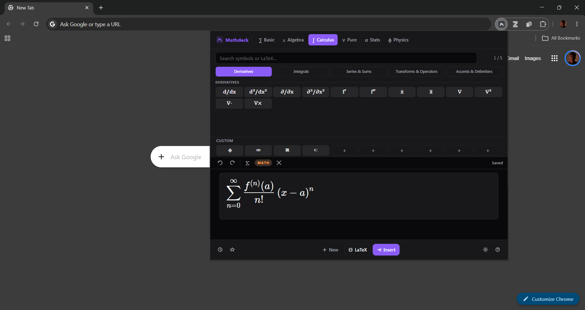

# Mathdeck Keyboard

A Chrome extension for writing and inserting math equations — pure HTML/CSS/JS with a small production build.

## Install locally

1. Install Node.js and npm.
2. Run `npm install` and then `npm run build`.
3. Open `chrome://extensions`.
4. Enable **Developer mode**.
5. Click **Load unpacked** and select the generated `dist/` folder.

## Development use

1. Clone or download this repository and open its folder in a terminal.
2. Install dependencies with `npm install`.
3. Build the extension with `npm run build`.
4. In Chrome, open `chrome://extensions`, enable **Developer mode**, and choose **Load unpacked**.
5. Select the project's `dist/` folder. The extension will appear in the extensions list and can be opened from the toolbar.
6. After changing source files, run `npm run build` again and click **Reload** for Mathdeck on the extensions page.

The source files are in the project root. `dist/` is generated by the build and is the folder loaded by Chrome; do not edit files inside `dist/` directly.

## Features

- **6 keyboard tabs** — Basic, Algebra, Calculus, Pure Math, Statistics, Physics
- **Searchable symbol catalog** — find keys by symbol, LaTeX command, hint, or category
- **Set theory notation** — indexed families, unions, intersections, products, complements, and set builders
- **Mixed text + math** — write full sentences with inline equations (like a textbook)
- **Matrix builder** — any size up to 8×8 with 6 bracket types
- **200+ keys** covering all standard mathematical and physical notation
- **Copy as** LaTeX
- **Insert into page** — injects directly into any focused input or contenteditable
- **Custom buttons** — 10 user-defined slots
- **Equation library** — save, load, rename, and delete favorite equations alongside recent equations
- **Undo / redo**, equation history, light/dark/auto theme, font color and size settings

## Usage

Type prose in **Text mode** (spaces work normally). Press **Alt+=** or click the mode button to switch to **Math mode** for equations. Click any keyboard key to insert notation at the cursor — works mid-sentence without breaking your text.

Click the heart button to save the current equation. Open the clock button to browse favorites and recent equations; select any item to load it back into the editor.

## Stack

- [MathLive](https://mathlive.io) for the math field and rendering
- [esbuild](https://esbuild.github.io) for the production bundle
- Manifest V3 — permissions: `activeTab`, `scripting`, `storage`, `clipboardWrite`

## Development checks

- `npm run check` validates the source JavaScript syntax.
- `npm test` builds `dist/` and verifies the packaged extension files.
